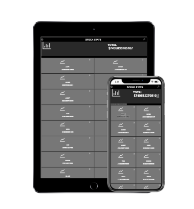

<a name="readme-top"></a>

<div align="center">

  
  <br/>

</div>

<!-- TABLE OF CONTENTS -->

# 📗 Table of Contents

- [📖 About the Project](#about-project)
  - [🛠 Built With](#built-with)
    - [Tech Stack](#tech-stack)
    - [Key Features](#key-features)
  - [🚀 Live Demo](#live-demo)
- [💻 Getting Started](#getting-started)
  - [Setup](#setup)
  - [Prerequisites](#prerequisites)
  - [Install](#install)
  - [Usage](#usage)
  - [Run tests](#run-tests)
  - [Deployment](#triangular_flag_on_post-deployment)
- [👥 Authors](#authors)
- [🔭 Future Features](#future-features)
- [🤝 Contributing](#contributing)
- [⭐️ Show your support](#support)
- [🙏 Acknowledgements](#acknowledgements)
- [📝 License](#license)

<!-- PROJECT DESCRIPTION -->

# 📖 Metric Web App <a name="about-project"></a>

<div align="center">

  
  <br/>

</div>

**Metric Web App** is a project to show API data on a SPA.

## 🛠 Built With <a name="built-with"></a>

### Tech Stack <a name="tech-stack"></a>

<details>
  <summary>JSX</summary>
  <ul>
    <li>Javascript</li>
  </ul>
</details>

<details>
  <summary>CSS</summary>
  <ul>
    <li>CSS</li>
  </ul>
</details>

<details>
<summary>REACT</summary>
  <ul>
    <li>Javascript</li>
  </ul>
</details>

<!-- Features -->

### Key Features <a name="key-features"></a>

- **Get data**
- **Show data**

<p align="right">(<a href="#readme-top">back to top</a>)</p>

LIVE DEMO

## 🚀 Live Demo <a name="live-demo"></a>

-[Live Demo](https://react-capstone-six.vercel.app/)

<p align="right">(<a href="#readme-top">back to top</a>)</p>

<!-- GETTING STARTED -->

## 💻 Getting Started <a name="getting-started"></a>

To get a local copy of this project up and running, follow these steps.

## Prerequisites

In order to run this project, you need to have the following installed on your machine:

- Node.js

## Setup

Clone this repository to your desired folder:

```
git clone <repository-url>
```

## Install

Install the project dependencies:

```
npm install
```

## Usage

To run the project, execute the following command:

```
npm start
```

The app will be running in development mode. Open [http://localhost:3000](http://localhost:3000) in your browser to view it.

## Run Tests

To run tests, use the following command:

```
npm test
```

This will launch the test runner in interactive watch mode.

## Deployment

You can deploy this project using the method of your choice. Refer to the appropriate deployment documentation for more information.

Feel free to customize and tweak the configuration files and scripts according to your requirements.

<!-- AUTHORS -->

## 👥 Authors <a name="authors"></a>

👤 **Author**

- GitHub: [@MarcoDDM](https://github.com/MarcoDDM)
- Twitter: [@nerdpiola](https://twitter.com/nerdpiola)
- LinkedIn: [LinkedIn](https://linkedin.com/in/marcoalmadaar)

<p align="right">(<a href="#readme-top">back to top</a>)</p>

<!-- FUTURE FEATURES -->

## 🔭 Future Features <a name="future-features"></a>

- [ ] **Different style**
- [ ] **Users**
- [ ] **Sharing**

<p align="right">(<a href="#readme-top">back to top</a>)</p>

<!-- CONTRIBUTING -->

## 🤝 Contributing <a name="contributing"></a>

Contributions, issues, and feature requests are welcome!

Feel free to check the [issues page](../../issues/).

<p align="right">(<a href="#readme-top">back to top</a>)</p>

<!-- SUPPORT -->

## ⭐️ Show your support <a name="support"></a>

If you like this project give a star to the project.

<p align="right">(<a href="#readme-top">back to top</a>)</p>

<!-- ACKNOWLEDGEMENTS -->

## 🙏 Acknowledgments <a name="acknowledgements"></a>

I would like to thank to all my coding partners. Original design idea by [Nelson Sakwa on Behance](https://www.behance.net/sakwadesignstudio).

<p align="right">(<a href="#readme-top">back to top</a>)</p>

<!-- LICENSE -->

## 📝 License <a name="license"></a>

This project is [MIT](./LICENSE) licensed.

<p align="right">(<a href="#readme-top">back to top</a>)</p>
